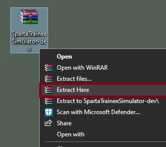

# Sparta Trainee Simulation Application (Java)
> Developed By:
>
> • Sami Zirak - Junior Java SDET Consultant | [Portfolio](https://samiz.dev/) | [GitHub](https://github.com/samizirakgamedev) | [LinkedIn](https://www.linkedin.com/in/sami-zirak-dezfouly/) | [Twitter](https://twitter.com/SamiZirakDev) |
>
> • Jack Gilbride - Junior Java SDET Consultant | [GitHub](https://github.com/ThatGuyGilby) | [LinkedIn](https://www.linkedin.com/in/jack-m-gilbride/) |
>
> • Andy Murray - Junior Java SDET Consultant | [GitHub](https://github.com/andymurray32) | [LinkedIn](https://www.linkedin.com/in/andrew-murray-40838213a/) |
> 
> • Mihai Udrea - Junior Java SDET Consultant | [GitHub](https://github.com/udreamihai) | [LinkedIn](https://www.linkedin.com/in/mihai-udrea-307885b7/) |
> 
> • Donovan Cupueran - Junior Java SDET Consultant | [GitHub](https://github.com/djucacupueran) | [LinkedIn](https://www.linkedin.com/in/donovan-juca-01b7aa222/) |
>
> • Gideon Troy - Junior Java SDET Consultant | [GitHub](https://github.com/Gideon9876543) | [LinkedIn](https://www.linkedin.com/in/gideon-troy-424b10216/) |
>
A simulator that will help track the number of people currently training at Sparta Academies. This project is part of our ongoing training @ [Sparta Global](https://www.spartaglobal.com/).
### Table Of Contents ###
+ [Software & Dependencies](#software-&-dependencies)
+ [How To Use](#how-to-use)
+ [Planned Project Phases](#planned-project-phases)
    - [Phase 1](#phase-1)
    - [Phase 2](#phase-2)
    - [Phase 3](#phase-3)
+ [Project Management](#project-management)
+ [JUnit Testing](#junit-testing)
### Software & Dependencies ###
* **IntelliJ Community Edition** [Version 2021.3.2](https://www.jetbrains.com/idea/download/#section=windows)
* **JDK** [Version 17.0.2](https://jdk.java.net/17/)
* **Apache Maven**
    * _**Note:** This dependency can be imported using IntelliJ._
    * _Go to **"File" > "New Project"** and then selecting **"Maven"** as the project structure._
* **JUnit Jupiter API** [Version 5.8.2](https://mvnrepository.com/artifact/org.junit.jupiter/junit-jupiter-api/5.8.2)
    * _**Note:** This dependency can be imported within Intellij using Apache Maven and IntelliJ's built-in dependency generator._
    * Alternatively you can open the Maven **"pom.xml"** file and paste in the following code within the **"dependencies"** section of the file:
```xml
    <dependency>
        <groupId>org.junit.jupiter</groupId>
        <artifactId>junit-jupiter</artifactId>
        <version>5.8.2</version>
    </dependency>
```
* **Log4J Core** [Version 2.17.1](https://mvnrepository.com/artifact/org.apache.logging.log4j/log4j-core/2.17.1)
    * _**Note:** This dependency can be imported within Intellij using Apache Maven and IntelliJ's built-in dependency generator._
    * Alternatively you can open the Maven **"pom.xml"** file and paste in the following code within the **"dependencies"** section of the file:
```xml
    <dependency>
        <groupId>org.apache.logging.log4j</groupId>
        <artifactId>log4j-core</artifactId>
        <version>2.17.1</version>
    </dependency> 
```
* **MySQL Connector** [Version 8.0.25](https://mvnrepository.com/artifact/mysql/mysql-connector-java/8.0.25)
    * _**Note:** This dependency can be imported within Intellij using Apache Maven and IntelliJ's built-in dependency generator._
    * Alternatively you can open the Maven **"pom.xml"** file and paste in the following code within the **"dependencies"** section of the file:
```xml
    <dependency>
        <groupId>mysql</groupId>
        <artifactId>mysql-connector-java</artifactId>
        <version>8.0.25</version>
    </dependency> 
```
<br/>
<div align="right">
    <b><a href="#sparta-trainee-simulation-application-java">↥ back to top</a></b>
</div>
<br/>

### How To Use ###
1. Navigate to the top of this GitHub repo and click the green **Code** button. This will open a menu where you will want to click **Download Zip**.


2. Having clicked **Download ZIP** a **Save As** dialogue box will open. Choose where you want to store the compressed Sparta Trainee Simulation program and then click the **Save** button.


3. Using Windows Explorer navigate to the location you saved the compressed Sparta Trainee Simulation program in. Right-click on the program and select **Extract Here**.



4. Open IntelliJ Community Edition and click **File** and then **Open**. Navigate to the extracted Sparta Trainee Simulation program project folder and select it. Then click **Ok**.


5. Once the project has opened and all dependencies have been downloaded look to the top right-hand corner of IntelliJ and ensure that the class that has been set to run is **DisplayMain**. You can now run the program by clicking the green play button.

 

<div align="right">
    <b><a href="#sparta-trainee-simulation-application-java">↥ back to top</a></b>
</div>
<br/>

### Planned Project Phases ###
#### Phase 1 ####
Phase 1 has the following objectives:
- The tracker needs to be able to track time in a consistent way.
- The program starts by asking how long the simulation will run for.
- Every month, a random number of trainees are generated wanting to be trained (50 -100).
- Every 2 months, Sparta global opens a training centre. They open instantly and can take trainees every month.
- A centre can train a max of 100 trainees and takes a random number of trainees every month. (0 - 50 trainees per month
  up to the max capacity).
- If a centre is full, trainees can be moved to any other centre which is not full.
- If all centres are full, the trainees go onto a waiting list. This list must be served first before new trainees are taken.
- At the end of the simulation, output should;
    - Number of open centres
    - Number of full centres
    - Number of trainees currently training
    - Number of trainees on the waiting list
#### Phase 2 ####
Phase 2 has the following objectives:
- Sparta will now check centres each month. If a centre has less than 25 trainees, it will close. The trainees will be randomly moved to another suitable centre.
- The simulation should now offer the choice of data at the end of the simulation or a running output updated each month.
- Trainees will now have a course type (Java, C#, Data, DevOps or Business). A trainee will be randomly assigned a course when they are created. This will never change.
- Sparta now has 3 different types of centre. When a new centre can be opened, one of the following will be randomly chosen.
  - **Training Hub**: can train a maximum of 100 trainees but 3 (randomly 1-3) can be opened at a time each month.
  - **Bootcamp**: can train a maximum of 500 trainees but can remain open for 3 months if there are less than 25 trainees in attendance.
    If a Bootcamp has 3 consecutive months of low attendance, it will close. For the lifetime of the simulation, only 2 Bootcamps can ever exist at a time.
  - **Tech Centre**: Can train 200 trainees but only teaches one course per centre. This is chosen randomly when a Tech Centre is opened.
- The simulation should report on the following:
    - Number of open centres (breakdown for each type)
    - Number of closed centres (breakdown for each type)
    - Number of full centres (breakdown for each type)
    - Number of trainees currently training (breakdown for each type)
    - Number of trainees on the waiting list (breakdown for each type)
#### Phase 3 ####
Phase 3 has the following objectives:
- If a trainee has been in training for 3 months, they are moved to a bench state
- Clients will begin to be randomly created after 1 year of the simulation
- A client will have a requirement when they are created e.g a need for 27 Java trainees. The requirement can be any value greater than or equal to 15
- A client will take a random number of trainees from the bench each month (1 - full requirement) until their requirement is met
- A client will only take one type of trainee (Java, C#, Data, DevOps or Business)
- If a client does not collect enough trainees from the bench within a year, they will leave unhappy
- If a client does collect enough trainees from the bench within a year, they will leave happy and return the next year with the same requirement

  <br/>
<div align="right">
    <b><a href="#sparta-trainee-simulation-application-java">↥ back to top</a></b>
</div>
<br/>

### Project Management ###
Throughout the project we made use of multiple project management tools including:
* **GitHub**, **GitHub Desktop** and **Sourcetree** for version control.
* **Trello** for sprint and task management.
* **Microsoft Teams** and **Discord** for collaborative working and meetings.

Bellow is a commit graph showing the commit history of the project: 


We each branched off and worked on our separate tasks and would then merge together to update each of our branches with an up-to-date version of the project. In the last few days of the project we branched off less and merged in more frequently to refactor,make final updates and fix bugs.

Our trello was also updated throughout our project to reflect the completion of deadlines and the completion of sprints and tests.


<br/>
<div align="right">
    <b><a href="#sparta-trainee-simulation-application-java">↥ back to top</a></b>
</div>
<br/>

### JUnit Testing ###

<br/>
<div align="right">
    <b><a href="#sparta-trainee-simulation-application-java">↥ back to top</a></b>
</div>
<br/>
